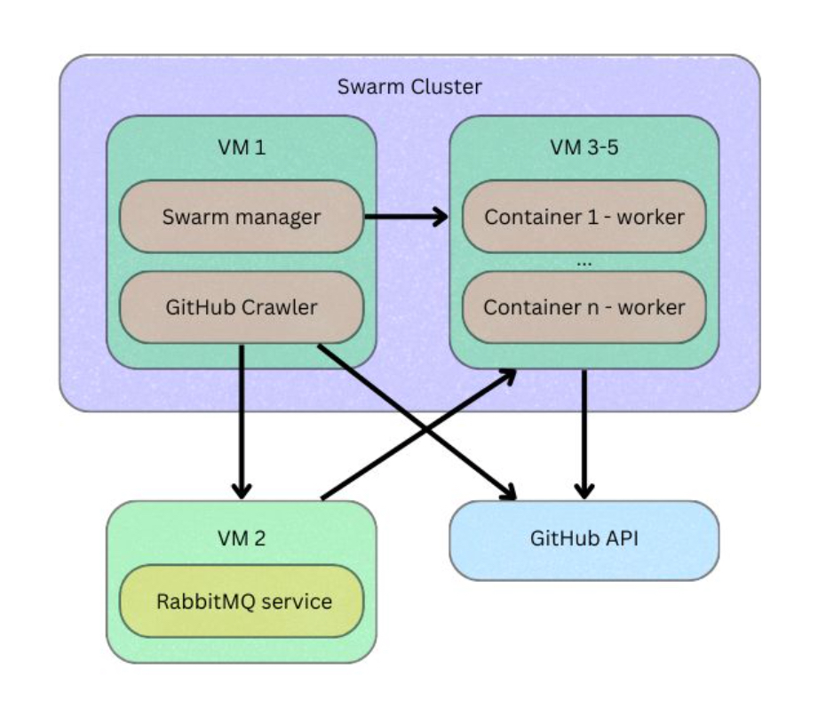
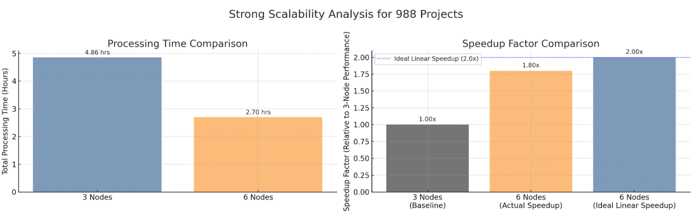
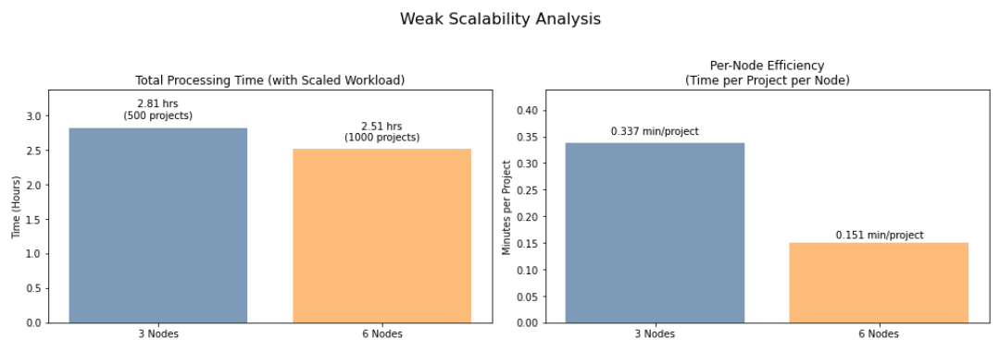

# 🧪 DataEngineeringII Project – Group 17

Group Members: Fredrik Forsman, Tingting Lyu, Nathalie Borglund, Yujia Liu, Yue Zhou

## ⚙️ Goal

Scalable, distributed unit testing on 1,000+ open-source Java projects using containerized Python workers, Maven, RabbitMQ, and Docker Swarm.

## 🔧 Key Technologies

Docker Swarm • RabbitMQ • GitHub REST API • Python • Maven • NFS

---

## 🛠️ System Architecture

This project deploys a 5-VM Docker Swarm architecture:

* **VM1**: Swarm Manager + Crawlers
* **VM2**: RabbitMQ Broker + NFS Server
* **VM3-VM5**: Worker nodes for parallel test execution

Each component is containerized and coordinated via a message queue.



---

## 🚀 Quick Start

### 1. Clone the Project

```bash
git clone https://github.com/yuegracezhou/DataEngineeringII.git
cd DataEngineeringII
```

### 2. Run Crawlers (GitHub Project Collection)

* 🔍 Crawler Details: [`project/crawler/README_EN.md`](./project/crawler/README_EN.md)
* Use `docker-compose` to start multiple crawlers with `.env` configs

```bash
docker compose up -d
```

Each crawler collects Java projects with Maven + test folders and streams metadata to RabbitMQ.

### 3. Publish JSON to Queue (Offline Mode)

```bash
cd project/crawler
python publisher.py  # Sends projects.json to RabbitMQ
```

---

## 🚧 Deploy Worker Services

### Option 1: 🤝 Swarm Mode (Recommended)

```bash
docker stack deploy -c worker-stack.yml worker_stack
```

* Deploys 3+ replicas of test workers
* Configured with:

  * `RABBITMQ_HOST`
  * NFS-mounted `/summary` volume

### Option 2: 🔢 Local Test via Docker Compose

```bash
cd project/worker
docker compose up -d
```

* For debugging or VM-local runs

---

## 🧰 Worker Logic (`worker.py`)

Each worker:

* Consumes one project/job from `project_queue`
* Clones GitHub repo with timeout (240s)
* Runs `mvn test` with timeout (360s)
* Parses logs to extract test stats
* Writes:

  * Raw logs → `/results/`
  * JSON summary → `/summary/`
* Sends ACK/NACK to RabbitMQ with detailed status

> Sample summary:

```json
{
  "project_name": "database-rider",
  "clone_url": "https://github.com/database-rider/database-rider.git",
  "node_id_or_worker_hostname": "25888535aa12",
  "status": "mvn_test_failed_rc1",
  "mvn_exit_code": 1,
  "tests_run": 12,
  "passed": 12,
  "failed_plus_errors": 0,
  "skipped": 0,
  "processing_start_time_monotonic": 41872.376747305,
  "processing_end_time_monotonic": 42065.114039133,
  "processing_start_absolute_epoch": 1748296613.4403028,
  "processing_end_absolute_epoch": 1748296806.1775956,
  "total_processing_duration_seconds": 192.73729182799434
}
```

---

## 📈 Performance Results

### Strong Scalability

| Nodes | Projects | Time   | Speed    |
| ----- | -------- | ------ | -------- |
| 3     | 988      | 4h 52m | 1.13/min |
| 6     | 988      | 2h 42m | 1.97/min |

**74% faster**, with **1.80x speedup** (ideal: 2.0x)



### Weak Scalability

| Nodes | Projects | Time   | Speed    |
| ----- | -------- | ------ | -------- |
| 3     | 500      | 2h 49m | 2.96/min |
| 6     | 1000     | 2h 30m | 6.64/min |

**Consistent timing** with doubled workload. **124% speedup** in throughput.



---

## 📂 Project Structure

```
project/
├── crawler/           # GitHub metadata collectors
│   ├── README_EN.md   # Module-specific docs
│   └── publisher.py   # Sends JSON to RabbitMQ
├── worker/            # Unit test runners
│   ├── newer_worker.py
│   ├── Dockerfile
│   └── docker-compose.yml
├── worker-stack.yml   # Swarm deploy config
└── docker-compose.yml # Crawler multi-container config
```

---

## 🛡️ Environment Variables

All components use `.env` files. Key fields:

```env
RABBITMQ_HOST=192.168.2.97
RABBITMQ_QUEUE=project_queue
```

Crawler `.env` files define search queries, token, pagination, etc.

---

🔎 Useful Links

🔍 Crawler Details: [`project/crawler/README_EN.md`](./project/crawler/README_EN.md)

📊 Full Project Report: [`docs/Data_Engineering_II_report.pdf`](./docs/Data_Engineering_II_report.pdf)

✏️ Author: Yue Zhou & Group 17 (Uppsala University)

---

Thank you for checking out our project!
